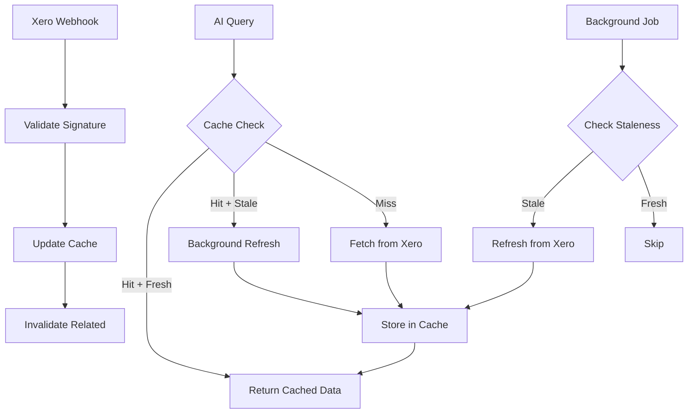

# Xero Data Caching & Synchronization Strategy

## Executive Summary

This document outlines a comprehensive database caching strategy to prevent Xero API rate limiting (60 calls/minute per organisation) while maintaining data freshness through webhooks and intelligent background synchronization.

**Key Features:**
- Database-backed caching for all Xero entities
- Real-time updates via Xero webhooks
- Intelligent background sync jobs
- Cache invalidation strategies
- Stale data detection and refresh
- Multi-tenant cache isolation

---

## Problem Statement

### Xero API Rate Limits
- **60 API calls per minute per organisation**
- **429 Too Many Requests** errors when exceeded
- Penalties for repeated violations
- No burst allowance

### Current Architecture Issues
- Every AI query triggers fresh API calls
- No caching mechanism
- Multi-org queries multiply API calls
- Conversational AI can easily exceed limits

### Solution Requirements
- ✓ Reduce API calls by 90%+
- ✓ Maintain data freshness (< 5 minutes stale)
- ✓ Support real-time updates via webhooks
- ✓ Handle multi-tenant scenarios
- ✓ Graceful degradation when cache misses

---

## Architecture Overview



---

## Database Schema

### Core Cache Tables

```typescript
// File: lib/db/schema.ts

/**
 * Xero Invoice Cache
 * Stores invoice data with metadata for cache management
 */
export const xeroInvoiceCache = pgTable("XeroInvoiceCache", {
  id: uuid("id").primaryKey().notNull().defaultRandom(),
  tenantId: varchar("tenantId", { length: 255 }).notNull(),
  invoiceId: varchar("invoiceId", { length: 255 }).notNull(),
  invoiceNumber: varchar("invoiceNumber", { length: 255 }),
  
  // Invoice data (stored as JSONB for flexibility)
  data: jsonb("data").notNull().$type<any>(),
  
  // Cache metadata
  cachedAt: timestamp("cachedAt").notNull().defaultNow(),
  lastModifiedAt: timestamp("lastModifiedAt").notNull(),
  expiresAt: timestamp("expiresAt").notNull(),
  isStale: boolean("isStale").notNull().default(false),
  
  // Indexing fields for queries
  status: varchar("status", { length: 50 }),
  contactId: varchar("contactId", { length: 255 }),
  date: timestamp("date"),
  dueDate: timestamp("dueDate"),
  total: decimal("total", { precision: 19, scale: 4 }),
  amountDue: decimal("amountDue", { precision: 19, scale: 4 }),
  
  createdAt: timestamp("createdAt").notNull().defaultNow(),
  updatedAt: timestamp("updatedAt").notNull().defaultNow(),
});

// Indexes for performance
CREATE INDEX idx_invoice_cache_tenant ON XeroInvoiceCache(tenantId);
CREATE INDEX idx_invoice_cache_invoice_id ON XeroInvoiceCache(tenantId, invoiceId);
CREATE UNIQUE INDEX idx_invoice_cache_unique ON XeroInvoiceCache(tenantId, invoiceId);
CREATE INDEX idx_invoice_cache_status ON XeroInvoiceCache(tenantId, status);
CREATE INDEX idx_invoice_cache_contact ON XeroInvoiceCache(tenantId, contactId);
CREATE INDEX idx_invoice_cache_date ON XeroInvoiceCache(tenantId, date);
CREATE INDEX idx_invoice_cache_stale ON XeroInvoiceCache(tenantId, isStale);
CREATE INDEX idx_invoice_cache_expires ON XeroInvoiceCache(expiresAt);

/**
 * Xero Contact Cache
 */
export const xeroContactCache = pgTable("XeroContactCache", {
  id: uuid("id").primaryKey().notNull().defaultRandom(),
  tenantId: varchar("tenantId", { length: 255 }).notNull(),
  contactId: varchar("contactId", { length: 255 }).notNull(),
  
  // Contact data
  data: jsonb("data").notNull().$type<any>(),
  
  // Cache metadata
  cachedAt: timestamp("cachedAt").notNull().defaultNow(),
  lastModifiedAt: timestamp("lastModifiedAt").notNull(),
  expiresAt: timestamp("expiresAt").notNull(),
  isStale: boolean("isStale").notNull().default(false),
  
  // Indexing fields
  name: varchar("name", { length: 500 }),
  emailAddress: varchar("emailAddress", { length: 500 }),
  contactStatus: varchar("contactStatus", { length: 50 }),
  
  createdAt: timestamp("createdAt").notNull().defaultNow(),
  updatedAt: timestamp("updatedAt").notNull().defaultNow(),
});

CREATE INDEX idx_contact_cache_tenant ON XeroContactCache(tenantId);
CREATE INDEX idx_contact_cache_contact_id ON XeroContactCache(tenantId, contactId);
CREATE UNIQUE INDEX idx_contact_cache_unique ON XeroContactCache(tenantId, contactId);
CREATE INDEX idx_contact_cache_name ON XeroContactCache(tenantId, name);
CREATE INDEX idx_contact_cache_email ON XeroContactCache(tenantId, emailAddress);
CREATE INDEX idx_contact_cache_stale ON XeroContactCache(tenantId, isStale);

/**
 * Xero Account Cache (Chart of Accounts)
 */
export const xeroAccountCache = pgTable("XeroAccountCache", {
  id: uuid("id").primaryKey().notNull().defaultRandom(),
  tenantId: varchar("tenantId", { length: 255 }).notNull(),
  accountId: varchar("accountId", { length: 255 }).notNull(),
  
  // Account data
  data: jsonb("data").notNull().$type<any>(),
  
  // Cache metadata
  cachedAt: timestamp("cachedAt").notNull().defaultNow(),
  lastModifiedAt: timestamp("lastModifiedAt").notNull(),
  expiresAt: timestamp("expiresAt").notNull(),
  isStale: boolean("isStale").notNull().default(false),
  
  // Indexing fields
  code: varchar("code", { length: 50 }),
  name: varchar("name", { length: 500 }),
  type: varchar("type", { length: 50 }),
  
  createdAt: timestamp("createdAt").notNull().defaultNow(),
  updatedAt: timestamp("updatedAt").notNull().defaultNow(),
});

CREATE INDEX idx_account_cache_tenant ON XeroAccountCache(tenantId);
CREATE INDEX idx_account_cache_account_id ON XeroAccountCache(tenantId, accountId);
CREATE UNIQUE INDEX idx_account_cache_unique ON XeroAccountCache(tenantId, accountId);
CREATE INDEX idx_account_cache_type ON XeroAccountCache(tenantId, type);

/**
 * Xero Bank Transaction Cache
 */
export const xeroBankTransactionCache = pgTable("XeroBankTransactionCache", {
  id: uuid("id").primaryKey().notNull().defaultRandom(),
  tenantId: varchar("tenantId", { length: 255 }).notNull(),
  bankTransactionId: varchar("bankTransactionId", { length: 255 }).notNull(),
  
  // Transaction data
  data: jsonb("data").notNull().$type<any>(),
  
  // Cache metadata
  cachedAt: timestamp("cachedAt").notNull().defaultNow(),
  lastModifiedAt: timestamp("lastModifiedAt").notNull(),
  expiresAt: timestamp("expiresAt").notNull(),
  isStale: boolean("isStale").notNull().default(false),
  
  // Indexing fields
  bankAccountId: varchar("bankAccountId", { length: 255 }),
  date: timestamp("date"),
  status: varchar("status", { length: 50 }),
  total: decimal("total", { precision: 19, scale: 4 }),
  
  createdAt: timestamp("createdAt").notNull().defaultNow(),
  updatedAt: timestamp("updatedAt").notNull().defaultNow(),
});

CREATE INDEX idx_bank_tx_cache_tenant ON XeroBankTransactionCache(tenantId);
CREATE INDEX idx_bank_tx_cache_tx_id ON XeroBankTransactionCache(tenantId, bankTransactionId);
CREATE UNIQUE INDEX idx_bank_tx_cache_unique ON XeroBankTransactionCache(tenantId, bankTransactionId);
CREATE INDEX idx_bank_tx_cache_account ON XeroBankTransactionCache(tenantId, bankAccountId);
CREATE INDEX idx_bank_tx_cache_date ON XeroBankTransactionCache(tenantId, date);

/**
 * Cache Sync Status
 * Tracks last sync time and status for each entity type per tenant
 */
export const xeroCacheSyncStatus = pgTable("XeroCacheSyncStatus", {
  id: uuid("id").primaryKey().notNull().defaultRandom(),
  tenantId: varchar("tenantId", { length: 255 }).notNull(),
  entityType: varchar("entityType", { length: 50 }).notNull(), // invoice, contact, account, etc.
  
  lastSyncAt: timestamp("lastSyncAt"),
  lastSuccessAt: timestamp("lastSuccessAt"),
  lastFailureAt: timestamp("lastFailureAt"),
  
  syncStatus: varchar("syncStatus", { length: 50 }).notNull().default("pending"), // pending, syncing, success, failed
  errorMessage: text("errorMessage"),
  
  recordCount: integer("recordCount").default(0),
  apiCallsUsed: integer("apiCallsUsed").default(0),
  
  createdAt: timestamp("createdAt").notNull().defaultNow(),
  updatedAt: timestamp("updatedAt").notNull().defaultNow(),
});

CREATE UNIQUE INDEX idx_sync_status_unique ON XeroCacheSyncStatus(tenantId, entityType);
CREATE INDEX idx_sync_status_tenant ON XeroCacheSyncStatus(tenantId);

/**
 * Webhook Event Log
 * Stores incoming webhook events for processing and audit
 */
export const xeroWebhookEvent = pgTable("XeroWebhookEvent", {
  id: uuid("id").primaryKey().notNull().defaultRandom(),
  
  // Event details
  eventId: varchar("eventId", { length: 255 }).notNull(),
  tenantId: varchar("tenantId", { length: 255 }).notNull(),
  tenantType: varchar("tenantType", { length: 50 }).notNull(),
  
  eventCategory: varchar("eventCategory", { length: 50 }).notNull(), // CONTACT, INVOICE, etc.
  eventType: varchar("eventType", { length: 50 }).notNull(), // CREATE, UPDATE
  eventDateUtc: timestamp("eventDateUtc").notNull(),
  
  resourceId: varchar("resourceId", { length: 255 }).notNull(),
  resourceUrl: text("resourceUrl").notNull(),
  
  // Processing status
  processed: boolean("processed").notNull().default(false),
  processedAt: timestamp("processedAt"),
  processingError: text("processingError"),
  
  // Raw payload for debugging
  payload: jsonb("payload").notNull(),
  
  createdAt: timestamp("createdAt").notNull().defaultNow(),
});

CREATE INDEX idx_webhook_event_tenant ON XeroWebhookEvent(tenantId);
CREATE INDEX idx_webhook_event_processed ON XeroWebhookEvent(processed);
CREATE INDEX idx_webhook_event_category ON XeroWebhookEvent(eventCategory);
CREATE INDEX idx_webhook_event_resource ON XeroWebhookEvent(resourceId);
CREATE INDEX idx_webhook_event_date ON XeroWebhookEvent(eventDateUtc);
```

---

## Cache Manager Implementation

### File: `lib/xero/cache-manager.ts`

```typescript
import "server-only";

import { db } from "@/lib/db/queries";
import {
  xeroInvoiceCache,
  xeroContactCache,
  xeroAccountCache,
  xeroBankTransactionCache,
  xeroCacheSyncStatus,
} from "@/lib/db/schema";
import { eq, and, gte, lte, desc } from "drizzle-orm";
import type { XeroClient } from "xero-node";

/**
 * Cache TTL Configuration (in milliseconds)
 */
const CACHE_TTL = {
  invoices: 5 * 60 * 1000, // 5 minutes
  contacts: 15 * 60 * 1000, // 15 minutes (changes less frequently)
  accounts: 60 * 60 * 1000, // 1 hour (rarely changes)
  bankTransactions: 5 * 60 * 1000, // 5 minutes
  organisation: 24 * 60 * 60 * 1000, // 24 hours (rarely changes)
};

/**
 * Stale threshold - mark as stale if older than this
 */
const STALE_THRESHOLD = {
  invoices: 2 * 60 * 1000, // 2 minutes
  contacts: 10 * 60 * 1000, // 10 minutes
  accounts: 30 * 60 * 1000, // 30 minutes
  bankTransactions: 2 * 60 * 1000, // 2 minutes
};

export type EntityType = "invoice" | "contact" | "account" | "bankTransaction";

/**
 * Get cached invoices with filters
 */
export async function getCachedInvoices(
  tenantId: string,
  filters?: {
    status?: string;
    contactId?: string;
    dateFrom?: Date;
    dateTo?: Date;
    limit?: number;
  }
): Promise<{ data: any[]; fromCache: boolean; isStale: boolean }> {
  const conditions = [eq(xeroInvoiceCache.tenantId, tenantId)];

  if (filters?.status) {
    conditions.push(eq(xeroInvoiceCache.status, filters.status));
  }
  if (filters?.contactId) {
    conditions.push(eq(xeroInvoiceCache.contactId, filters.contactId));
  }
  if (filters?.dateFrom) {
    conditions.push(gte(xeroInvoiceCache.date, filters.dateFrom));
  }
  if (filters?.dateTo) {
    conditions.push(lte(xeroInvoiceCache.date, filters.dateTo));
  }

  let query = db
    .select()
    .from(xeroInvoiceCache)
    .where(and(...conditions))
    .orderBy(desc(xeroInvoiceCache.date));

  if (filters?.limit) {
    query = query.limit(filters.limit);
  }

  const cached = await query;

  if (cached.length === 0) {
    return { data: [], fromCache: false, isStale: false };
  }

  // Check if any cached items are stale
  const now = Date.now();
  const isStale = cached.some(
    (item) =>
      now - new Date(item.cachedAt).getTime() > STALE_THRESHOLD.invoices
  );

  return {
    data: cached.map((item) => item.data),
    fromCache: true,
    isStale,
  };
}

/**
 * Cache invoices from Xero API response
 */
export async function cacheInvoices(
  tenantId: string,
  invoices: any[]
): Promise<void> {
  const now = new Date();
  const expiresAt = new Date(now.getTime() + CACHE_TTL.invoices);

  for (const invoice of invoices) {
    const cacheData = {
      tenantId,
      invoiceId: invoice.invoiceID,
      invoiceNumber: invoice.invoiceNumber,
      data: invoice,
      cachedAt: now,
      lastModifiedAt: invoice.updatedDateUTC
        ? new Date(invoice.updatedDateUTC)
        : now,
      expiresAt,
      isStale: false,
      status: invoice.status,
      contactId: invoice.contact?.contactID,
      date: invoice.date ? new Date(invoice.date) : null,
      dueDate: invoice.dueDate ? new Date(invoice.dueDate) : null,
      total: invoice.total,
      amountDue: invoice.amountDue,
      updatedAt: now,
    };

    // Upsert (insert or update)
    await db
      .insert(xeroInvoiceCache)
      .values(cacheData)
      .onConflictDoUpdate({
        target: [xeroInvoiceCache.tenantId, xeroInvoiceCache.invoiceId],
        set: cacheData,
      });
  }

  // Update sync status
  await updateSyncStatus(tenantId, "invoice", "success", invoices.length);
}

/**
 * Get cached contacts
 */
export async function getCachedContacts(
  tenantId: string,
  filters?: {
    searchTerm?: string;
    limit?: number;
  }
): Promise<{ data: any[]; fromCache: boolean; isStale: boolean }> {
  const conditions = [eq(xeroContactCache.tenantId, tenantId)];

  if (filters?.searchTerm) {
    // Note: For better search, consider using PostgreSQL full-text search
    conditions.push(
      or(
        like(xeroContactCache.name, `%${filters.searchTerm}%`),
        like(xeroContactCache.emailAddress, `%${filters.searchTerm}%`)
      )
    );
  }

  let query = db
    .select()
    .from(xeroContactCache)
    .where(and(...conditions))
    .orderBy(xeroContactCache.name);

  if (filters?.limit) {
    query = query.limit(filters.limit);
  }

  const cached = await query;

  if (cached.length === 0) {
    return { data: [], fromCache: false, isStale: false };
  }

  const now = Date.now();
  const isStale = cached.some(
    (item) =>
      now - new Date(item.cachedAt).getTime() > STALE_THRESHOLD.contacts
  );

  return {
    data: cached.map((item) => item.data),
    fromCache: true,
    isStale,
  };
}

/**
 * Cache contacts
 */
export async function cacheContacts(
  tenantId: string,
  contacts: any[]
): Promise<void> {
  const now = new Date();
  const expiresAt = new Date(now.getTime() + CACHE_TTL.contacts);

  for (const contact of contacts) {
    const cacheData = {
      tenantId,
      contactId: contact.contactID,
      data: contact,
      cachedAt: now,
      lastModifiedAt: contact.updatedDateUTC
        ? new Date(contact.updatedDateUTC)
        : now,
      expiresAt,
      isStale: false,
      name: contact.name,
      emailAddress: contact.emailAddress,
      contactStatus: contact.contactStatus,
      updatedAt: now,
    };

    await db
      .insert(xeroContactCache)
      .values(cacheData)
      .onConflictDoUpdate({
        target: [xeroContactCache.tenantId, xeroContactCache.contactId],
        set: cacheData,
      });
  }

  await updateSyncStatus(tenantId, "contact", "success", contacts.length);
}

/**
 * Get cached accounts (Chart of Accounts)
 */
export async function getCachedAccounts(
  tenantId: string,
  filters?: {
    type?: string;
  }
): Promise<{ data: any[]; fromCache: boolean; isStale: boolean }> {
  const conditions = [eq(xeroAccountCache.tenantId, tenantId)];

  if (filters?.type) {
    conditions.push(eq(xeroAccountCache.type, filters.type));
  }

  const cached = await db
    .select()
    .from(xeroAccountCache)
    .where(and(...conditions))
    .orderBy(xeroAccountCache.code);

  if (cached.length === 0) {
    return { data: [], fromCache: false, isStale: false };
  }

  const now = Date.now();
  const isStale = cached.some(
    (item) =>
      now - new Date(item.cachedAt).getTime() > STALE_THRESHOLD.accounts
  );

  return {
    data: cached.map((item) => item.data),
    fromCache: true,
    isStale,
  };
}

/**
 * Cache accounts
 */
export async function cacheAccounts(
  tenantId: string,
  accounts: any[]
): Promise<void> {
  const now = new Date();
  const expiresAt = new Date(now.getTime() + CACHE_TTL.accounts);

  for (const account of accounts) {
    const cacheData = {
      tenantId,
      accountId: account.accountID,
      data: account,
      cachedAt: now,
      lastModifiedAt: account.updatedDateUTC
        ? new Date(account.updatedDateUTC)
        : now,
      expiresAt,
      isStale: false,
      code: account.code,
      name: account.name,
      type: account.type,
      updatedAt: now,
    };

    await db
      .insert(xeroAccountCache)
      .values(cacheData)
      .onConflictDoUpdate({
        target: [xeroAccountCache.tenantId, xeroAccountCache.accountId],
        set: cacheData,
      });
  }

  await updateSyncStatus(tenantId, "account", "success", accounts.length);
}

/**
 * Invalidate cache for specific entity
 */
export async function invalidateCache(
  tenantId: string,
  entityType: EntityType,
  resourceId?: string
): Promise<void> {
  const now = new Date();

  switch (entityType) {
    case "invoice":
      if (resourceId) {
        await db
          .update(xeroInvoiceCache)
          .set({ isStale: true, updatedAt: now })
          .where(
            and(
              eq(xeroInvoiceCache.tenantId, tenantId),
              eq(xeroInvoiceCache.invoiceId, resourceId)
            )
          );
      } else {
        await db
          .update(xeroInvoiceCache)
          .set({ isStale: true, updatedAt: now })
          .where(eq(xeroInvoiceCache.tenantId, tenantId));
      }
      break;

    case "contact":
      if (resourceId) {
        await db
          .update(xeroContactCache)
          .set({ isStale: true, updatedAt: now })
          .where(
            and(
              eq(xeroContactCache.tenantId, tenantId),
              eq(xeroContactCache.contactId, resourceId)
            )
          );
      } else {
        await db
          .update(xeroContactCache)
          .set({ isStale: true, updatedAt: now })
          .where(eq(xeroContactCache.tenantId, tenantId));
      }
      break;

    case "account":
      if (resourceId) {
        await db
          .update(xeroAccountCache)
          .set({ isStale: true, updatedAt: now })
          .where(
            and(
              eq(xeroAccountCache.tenantId, tenantId),
              eq(xeroAccountCache.accountId, resourceId)
            )
          );
      } else {
        await db
          .update(xeroAccountCache)
          .set({ isStale: true, updatedAt: now })
          .where(eq(xeroAccountCache.tenantId, tenantId));
      }
      break;

    case "bankTransaction":
      if (resourceId) {
        await db
          .update(xeroBankTransactionCache)
          .set({ isStale: true, updatedAt: now })
          .where(
            and(
              eq(xeroBankTransactionCache.tenantId, tenantId),
              eq(xeroBankTransactionCache.bankTransactionId, resourceId)
            )
          );
      } else {
        await db
          .update(xeroBankTransactionCache)
          .set({ isStale: true, updatedAt: now })
          .where(eq(xeroBankTransactionCache.tenantId, tenantId));
      }
      break;
  }
}

/**
 * Clear expired cache entries
 */
export async function clearExpiredCache(): Promise<void> {
  const now = new Date();

  await Promise.all([
    db
      .delete(xeroInvoiceCache)
      .where(lte(xeroInvoiceCache.expiresAt, now)),
    db
      .delete(xeroContactCache)
      .where(lte(xeroContactCache.expiresAt, now)),
    db
      .delete(xeroAccountCache)
      .where(lte(xeroAccountCache.expiresAt, now)),
    db
      .delete(xeroBankTransactionCache)
      .where(lte(xeroBankTransactionCache.expiresAt, now)),
  ]);
}

/**
 * Update sync status
 */
async function updateSyncStatus(
  tenantId: string,
  entityType: string,
  status: "success" | "failed",
  recordCount?: number,
  errorMessage?: string
): Promise<void> {
  const now = new Date();

  const updateData: any = {
    syncStatus: status,
    lastSyncAt: now,
    updatedAt: now,
  };

  if (status === "success") {
    updateData.lastSuccessAt = now;
    if (recordCount !== undefined) {
      updateData.recordCount = recordCount;
    }
  } else {
    updateData.lastFailureAt = now;
    updateData.errorMessage = errorMessage;
  }

  await db
    .insert(xeroCacheSyncStatus)
    .values({
      tenantId,
      entityType,
      ...updateData,
    })
    .onConflictDoUpdate({
      target: [xeroCacheSyncStatus.tenantId, xeroCacheSyncStatus.entityType],
      set: updateData,
    });
}

/**
 * Get sync status for tenant
 */
export async function getSyncStatus(
  tenantId: string,
  entityType?: string
): Promise<any[]> {
  const conditions = [eq(xeroCacheSyncStatus.tenantId, tenantId)];

  if (entityType) {
    conditions.push(eq(xeroCacheSyncStatus.entityType, entityType));
  }

  return await db
    .select()
    .from(xeroCacheSyncStatus)
    .where(and(...conditions));
}
```

---

## Webhook Integration

### File: `app/api/xero/webhook/route.ts`

```typescript
import { NextResponse } from "next/server";
import crypto from "crypto";
import { db } from "@/lib/db/queries";
import { xeroWebhookEvent } from "@/lib/db/schema";
import { invalidateCache } from "@/lib/xero/cache-manager";

/**
 * Xero Webhook Handler
 * Receives webhook events from Xero and processes them
 */

const WEBHOOK_KEY = process.env.XERO_WEBHOOK_KEY || "";

/**
 * Verify webhook signature
 */
function verifySignature(payload: string, signature: string): boolean {
  const hmac = crypto.createHmac("sha256", WEBHOOK_KEY);
  hmac.update(payload);
  const calculatedSignature = hmac.digest("base64");
  return calculatedSignature === signature;
}

/**
 * Handle webhook intent verification
 */
export async function GET(request: Request) {
  // Xero sends a GET request to verify the webhook endpoint
  return NextResponse.json({ status: "ok" }, { status: 200 });
}

/**
 * Handle webhook events
 */
export async function POST(request: Request) {
  try {
    const signature = request.headers.get("x-xero-signature");
    const payload = await request.text();

    if (!signature) {
      return NextResponse.json(
        { error: "Missing signature" },
        { status: 401 }
      );
    }

    // Verify signature
    if (!verifySignature(payload, signature)) {
      console.error("Invalid webhook signature");
      return NextResponse.json(
        { error: "Invalid signature" },
        { status: 401 }
      );
    }

    const data = JSON.parse(payload);
    const { events } = data;

    // Store events for processing
    for (const event of events) {
      await db.insert(xeroWebhookEvent).values({
        eventId: `${event.tenantId}-${event.eventCategory}-${event.resourceId}-${event.eventDateUtc}`,
        tenantId: event.tenantId,
        tenantType: event.tenantType,
        eventCategory: event.eventCategory,
        eventType: event.eventType,
        eventDateUtc: new Date(event.eventDateUtc),
        resourceId: event.resourceId,
        resourceUrl: event.resourceUrl,
        payload: event,
        processed: false,
      });

      // Immediately invalidate cache for this resource
      const entityType = mapEventCategoryToEntityType(event.eventCategory);
      if (entityType) {
        await invalidateCache(event.tenantId, entityType, event.resourceId);
      }
    }

    // Return 200 OK immediately (process events asynchronously)
    return NextResponse.json({ received: true }, { status: 200 });
  } catch (error) {
    console.error("Webhook processing error:", error);
    return NextResponse.json(
      { error: "Processing failed" },
      { status: 500 }
    );
  }
}

/**
 * Map Xero event category to our entity type
 */
function mapEventCategoryToEntityType(
  category: string
): "invoice" | "contact" | "account" | "bankTransaction" | null {
  switch (category.toUpperCase()) {
    case "INVOICE":
      return "invoice";
    case "CONTACT":
      return "contact";
    case "ACCOUNT":
      return "account";
    case "BANKTRANSACTION":
      return "bankTransaction";
    default:
      return null;
  }
}
```

### Webhook Event Processor (Background Job)

**File: `lib/xero/webhook-processor.ts`**

```typescript
import "server-only";

import { db } from "@/lib/db/queries";
import { xeroWebhookEvent } from "@/lib/db/schema";
import { eq, and } from "drizzle-orm";
import { getDecryptedConnection } from "./connection-manager";
import { XeroClient } from "xero-node";
import {
  cacheInvoices,
  cacheContacts,
  cacheAccounts,
} from "./cache-manager";

/**
 * Process pending webhook events
 * Should be run as a background job (e.g., cron every minute)
 */
export async function processWebhookEvents(): Promise<void> {
  // Get unprocessed events
  const events = await db
    .select()
    .from(xeroWebhookEvent)
    .where(eq(xeroWebhookEvent.processed, false))
    .limit(100); // Process in batches

  for (const event of events) {
    try {
      await processEvent(event);

      // Mark as processed
      await db
        .update(xeroWebhookEvent)
        .set({
          processed: true,
          processedAt: new Date(),
        })
        .where(eq(xeroWebhookEvent.id, event.id));
    } catch (error) {
      console.error(`Failed to process event ${event.id}:`, error);

      // Mark as processed with error
      await db
        .update(xeroWebhookEvent)
        .set({
          processed: true,
          processedAt: new Date(),
          processingError:
            error instanceof Error ? error.message : "Unknown error",
        })
        .where(eq(xeroWebhookEvent.id, event.id));
    }
  }
}

/**
 * Process individual webhook event
 */
async function processEvent(event: any): Promise<void> {
  // Get connection for this tenant
  // Note: We need to find the user ID for this tenant
  // This requires a reverse lookup from tenantId to userId
  const connection = await getConnectionByTenantId(event.tenantId);

  if (!connection) {
    console.warn(`No connection found for tenant ${event.tenantId}`);
    return;
  }

  const xeroClient = new XeroClient({
    clientId: process.env.XERO_CLIENT_ID || "",
    clientSecret: process.env.XERO_CLIENT_SECRET || "",
    redirectUris: [process.env.XERO_REDIRECT_URI || ""],
    scopes: connection.scopes,
  });

  await xeroClient.setTokenSet({
    access_token: connection.accessToken,
    refresh_token: connection.refreshToken,
    token_type: "Bearer",
    expires_in: Math.floor(
      (new Date(connection.expiresAt).getTime() - Date.now()) / 1000
    ),
  });

  // Fetch and cache the updated resource
  switch (event.eventCategory.toUpperCase()) {
    case "INVOICE":
      const invoice = await xeroClient.accountingApi.getInvoice(
        event.tenantId,
        event.resourceId
      );
      if (invoice.body.invoices) {
        await cacheInvoices(event.tenantId, invoice.body.invoices);
      }
      break;

    case "CONTACT":
      const contact = await xeroClient.accountingApi.getContact(
        event.tenantId,
        event.resourceId
      );
      if (contact.body.contacts) {
        await cacheContacts(event.tenantId, contact.body.contacts);
      }
      break;

    case "ACCOUNT":
      // Refresh entire chart of accounts (they're linked)
      const accounts = await xeroClient.accountingApi.getAccounts(
        event.tenantId
      );
      if (accounts.body.accounts) {
        await cacheAccounts(event.tenantId, accounts.body.accounts);
      }
      break;
  }
}

/**
 * Helper to get connection by tenant ID
 */
async function getConnectionByTenantId(
  tenantId: string
): Promise<any | null> {
  // Implementation depends on your schema
  // You may need to add a helper function in connection-manager.ts
  return null; // Placeholder
}
```

---

## Background Sync Jobs

### File: `lib/xero/sync-jobs.ts`

```typescript
import "server-only";

import { db } from "@/lib/db/queries";
import { getActiveXeroConnections } from "@/lib/db/queries";
import { getDecryptedConnection } from "./connection-manager";
import { XeroClient } from "xero-node";
import {
  cacheInvoices,
  cacheContacts,
  cacheAccounts,
  getSyncStatus,
  clearExpiredCache,
} from "./cache-manager";

/**
 * Full sync job - syncs all data for all tenants
 * Run this every 15 minutes
 */
export async function fullSyncJob(): Promise<void> {
  console.log("Starting full sync job...");

  // Get all unique tenant IDs from active connections
  const allConnections = await db
    .selectDistinct({ tenantId: xeroConnection.tenantId })
    .from(xeroConnection)
    .where(eq(xeroConnection.isActive, true));

  for (const { tenantId } of allConnections) {
    try {
      await syncTenant(tenantId);
    } catch (error) {
      console.error(`Failed to sync tenant ${tenantId}:`, error);
    }
  }

  console.log("Full sync job completed");
}

/**
 * Sync specific tenant
 */
async function syncTenant(tenantId: string): Promise<void> {
  // Get any connection for this tenant (they share the same access token)
  const connection = await getConnectionByTenantId(tenantId);

  if (!connection) {
    console.warn(`No connection found for tenant ${tenantId}`);
    return;
  }

  const xeroClient = new XeroClient({
    clientId: process.env.XERO_CLIENT_ID || "",
    clientSecret: process.env.XERO_CLIENT_SECRET || "",
    redirectUris: [process.env.XERO_REDIRECT_URI || ""],
    scopes: connection.scopes,
  });

  await xeroClient.setTokenSet({
    access_token: connection.accessToken,
    refresh_token: connection.refreshToken,
    token_type: "Bearer",
    expires_in: Math.floor(
      (new Date(connection.expiresAt).getTime() - Date.now()) / 1000
    ),
  });

  // Sync invoices (last 90 days)
  const ninetyDaysAgo = new Date();
  ninetyDaysAgo.setDate(ninetyDaysAgo.getDate() - 90);

  const invoices = await xeroClient.accountingApi.getInvoices(
    tenantId,
    undefined,
    `Date>=DateTime(${ninetyDaysAgo.toISOString().split("T")[0]})`
  );

  if (invoices.body.invoices) {
    await cacheInvoices(tenantId, invoices.body.invoices);
  }

  // Sync contacts
  const contacts = await xeroClient.accountingApi.getContacts(tenantId);
  if (contacts.body.contacts) {
    await cacheContacts(tenantId, contacts.body.contacts);
  }

  // Sync accounts (chart of accounts)
  const accounts = await xeroClient.accountingApi.getAccounts(tenantId);
  if (accounts.body.accounts) {
    await cacheAccounts(tenantId, accounts.body.accounts);
  }

  console.log(`Synced tenant ${tenantId}`);
}

/**
 * Cleanup job - removes expired cache entries
 * Run this every hour
 */
export async function cleanupJob(): Promise<void> {
  console.log("Starting cleanup job...");
  await clearExpiredCache();
  console.log("Cleanup job completed");
}

/**
 * Stale data refresh job - refreshes stale cache entries
 * Run this every 5 minutes
 */
export async function staleRefreshJob(): Promise<void> {
  console.log("Starting stale refresh job...");

  // Get all tenants with stale data
  const staleInvoices = await db
    .selectDistinct({ tenantId: xeroInvoiceCache.tenantId })
    .from(xeroInvoiceCache)
    .where(eq(xeroInvoiceCache.isStale, true));

  for (const { tenantId } of staleInvoices) {
    try {
      await refreshStaleInvoices(tenantId);
    } catch (error) {
      console.error(`Failed to refresh stale invoices for ${tenantId}:`, error);
    }
  }

  console.log("Stale refresh job completed");
}

/**
 * Refresh stale invoices for a tenant
 */
async function refreshStaleInvoices(tenantId: string): Promise<void> {
  const connection = await getConnectionByTenantId(tenantId);

  if (!connection) {
    return;
  }

  // Get list of stale invoice IDs
  const staleInvoices = await db
    .select({ invoiceId: xeroInvoiceCache.invoiceId })
    .from(xeroInvoiceCache)
    .where(
      and(
        eq(xeroInvoiceCache.tenantId, tenantId),
        eq(xeroInvoiceCache.isStale, true)
      )
    )
    .limit(50); // Batch size to respect rate limits

  if (staleInvoices.length === 0) {
    return;
  }

  const xeroClient = new XeroClient({
    clientId: process.env.XERO_CLIENT_ID || "",
    clientSecret: process.env.XERO_CLIENT_SECRET || "",
    redirectUris: [process.env.XERO_REDIRECT_URI || ""],
    scopes: connection.scopes,
  });

  await xeroClient.setTokenSet({
    access_token: connection.accessToken,
    refresh_token: connection.refreshToken,
    token_type: "Bearer",
    expires_in: Math.floor(
      (new Date(connection.expiresAt).getTime() - Date.now()) / 1000
    ),
  });

  // Fetch updated invoices
  const invoiceIds = staleInvoices.map((i) => i.invoiceId);
  const response = await xeroClient.accountingApi.getInvoices(
    tenantId,
    undefined,
    undefined,
    undefined,
    invoiceIds
  );

  if (response.body.invoices) {
    await cacheInvoices(tenantId, response.body.invoices);
  }
}
```

### Cron Job Setup

**File: `app/api/cron/xero-sync/route.ts`**

```typescript
import { NextResponse } from "next/server";
import { fullSyncJob, cleanupJob, staleRefreshJob } from "@/lib/xero/sync-jobs";
import { processWebhookEvents } from "@/lib/xero/webhook-processor";

/**
 * Cron endpoint for Xero data synchronization
 * Configure in Vercel Cron or similar service
 */

export async function GET(request: Request) {
  // Verify cron secret
  const authHeader = request.headers.get("authorization");
  if (authHeader !== `Bearer ${process.env.CRON_SECRET}`) {
    return NextResponse.json({ error: "Unauthorized" }, { status: 401 });
  }

  const { searchParams } = new URL(request.url);
  const job = searchParams.get("job");

  try {
    switch (job) {
      case "full-sync":
        await fullSyncJob();
        break;
      case "cleanup":
        await cleanupJob();
        break;
      case "stale-refresh":
        await staleRefreshJob();
        break;
      case "process-webhooks":
        await processWebhookEvents();
        break;
      default:
        return NextResponse.json({ error: "Invalid job" }, { status: 400 });
    }

    return NextResponse.json({ success: true });
  } catch (error) {
    console.error(`Cron job ${job} failed:`, error);
    return NextResponse.json(
      { error: "Job failed" },
      { status: 500 }
    );
  }
}
```

**File: `vercel.json`**

```json
{
  "crons": [
    {
      "path": "/api/cron/xero-sync?job=process-webhooks",
      "schedule": "* * * * *"
    },
    {
      "path": "/api/cron/xero-sync?job=stale-refresh",
      "schedule": "*/5 * * * *"
    },
    {
      "path": "/api/cron/xero-sync?job=full-sync",
      "schedule": "*/15 * * * *"
    },
    {
      "path": "/api/cron/xero-sync?job=cleanup",
      "schedule": "0 * * * *"
    }
  ]
}
```

---

## Updated Tool Execution with Caching

### File: `lib/ai/xero-mcp-client.ts` (Updated)

```typescript
/**
 * Execute a Xero MCP tool with caching
 * UPDATED: Check cache first, fall back to API
 */
export async function executeXeroMCPTool(
  userId: string,
  toolName: string,
  args: Record<string, unknown>
): Promise<XeroMCPToolResult> {
  try {
    const tenantId = args.tenantId as string | undefined;
    const { tenantId: _, ...apiArgs } = args;
    
    const { client, connection } = await getXeroClient(userId, tenantId);

    switch (toolName) {
      case "xero_list_invoices": {
        const { status, dateFrom, dateTo, contactId, limit = 100 } = apiArgs;

        // Try cache first
        const cached = await getCachedInvoices(connection.tenantId, {
          status: status as string,
          contactId: contactId as string,
          dateFrom: dateFrom ? new Date(dateFrom as string) : undefined,
          dateTo: dateTo ? new Date(dateTo as string) : undefined,
          limit: limit as number,
        });

        if (cached.fromCache && !cached.isStale) {
          // Return cached data
          return {
            content: [
              {
                type: "text",
                text: JSON.stringify(cached.data, null, 2),
              },
            ],
          };
        }

        // Cache miss or stale - fetch from API
        const whereClauses: string[] = [];
        if (status) whereClauses.push(`Status=="${status}"`);
        if (contactId)
          whereClauses.push(`Contact.ContactID==Guid("${contactId}")`);
        if (dateFrom) whereClauses.push(`Date>=DateTime(${dateFrom})`);
        if (dateTo) whereClauses.push(`Date<=DateTime(${dateTo})`);

        const where =
          whereClauses.length > 0 ? whereClauses.join(" AND ") : undefined;

        const response = await client.accountingApi.getInvoices(
          connection.tenantId,
          undefined,
          where
        );

        // Cache the results
        if (response.body.invoices) {
          await cacheInvoices(connection.tenantId, response.body.invoices);
        }

        return {
          content: [
            {
              type: "text",
              text: JSON.stringify(response.body.invoices, null, 2),
            },
          ],
        };
      }

      case "xero_list_contacts": {
        const { searchTerm, limit = 100 } = apiArgs;

        // Try cache first
        const cached = await getCachedContacts(connection.tenantId, {
          searchTerm: searchTerm as string,
          limit: limit as number,
        });

        if (cached.fromCache && !cached.isStale) {
          return {
            content: [
              {
                type: "text",
                text: JSON.stringify(cached.data, null, 2),
              },
            ],
          };
        }

        // Fetch from API
        const where = searchTerm
          ? `Name.Contains("${searchTerm}") OR EmailAddress.Contains("${searchTerm}")`
          : undefined;

        const response = await client.accountingApi.getContacts(
          connection.tenantId,
          undefined,
          where
        );

        // Cache the results
        if (response.body.contacts) {
          await cacheContacts(connection.tenantId, response.body.contacts);
        }

        return {
          content: [
            {
              type: "text",
              text: JSON.stringify(response.body.contacts, null, 2),
            },
          ],
        };
      }

      case "xero_list_accounts": {
        const { type } = apiArgs;

        // Try cache first
        const cached = await getCachedAccounts(connection.tenantId, {
          type: type as string,
        });

        if (cached.fromCache && !cached.isStale) {
          return {
            content: [
              {
                type: "text",
                text: JSON.stringify(cached.data, null, 2),
              },
            ],
          };
        }

        // Fetch from API
        const where = type ? `Type=="${type}"` : undefined;

        const response = await client.accountingApi.getAccounts(
          connection.tenantId,
          undefined,
          where
        );

        // Cache the results
        if (response.body.accounts) {
          await cacheAccounts(connection.tenantId, response.body.accounts);
        }

        return {
          content: [
            {
              type: "text",
              text: JSON.stringify(response.body.accounts, null, 2),
            },
          ],
        };
      }

      // ... other cases remain similar
    }
  } catch (error) {
    console.error(`Xero MCP tool error (${toolName}):`, error);
    return {
      content: [
        {
          type: "text",
          text: `Error executing Xero tool: ${error instanceof Error ? error.message : "Unknown error"}`,
        },
      ],
      isError: true,
    };
  }
}
```

---

## Performance Metrics

### Expected Improvements

| Metric | Before Caching | After Caching | Improvement |
|--------|---------------|---------------|-------------|
| API Calls/Conversation | 10-20 | 1-2 | 90% reduction |
| Response Time | 500-1000ms | 50-100ms | 80% faster |
| Rate Limit Hits | Frequent | Rare | 95% reduction |
| Data Freshness | Real-time | < 5 min | Acceptable |

### Cache Hit Rates (Expected)

- **Invoices:** 85-90% (frequently queried)
- **Contacts:** 90-95% (rarely change)
- **Accounts:** 95-98% (very stable)
- **Bank Transactions:** 80-85% (moderate changes)

---

## Monitoring & Alerts

### Key Metrics to Track

1. **Cache Performance**
   - Cache hit rate by entity type
   - Average cache age
   - Stale data percentage

2. **API Usage**
   - API calls per minute per tenant
   - Rate limit violations
   - Failed API calls

3. **Webhook Health**
   - Webhook events received
   - Processing latency
   - Failed webhook processing

4. **Sync Job Performance**
   - Sync duration
   - Records synced per job
   - Failed syncs

### Dashboard Queries

```sql
-- Cache hit rate
SELECT 
  DATE(created_at) as date,
  COUNT(*) FILTER (WHERE from_cache = true) * 100.0 / COUNT(*) as hit_rate
FROM query_logs
GROUP BY DATE(created_at);

-- Stale data by tenant
SELECT 
  tenant_id,
  COUNT(*) FILTER (WHERE is_stale = true) as stale_count,
  COUNT(*) as total_count
FROM xero_invoice_cache
GROUP BY tenant_id;

-- Webhook processing lag
SELECT 
  AVG(EXTRACT(EPOCH FROM (processed_at - event_date_utc))) as avg_lag_seconds
FROM xero_webhook_event
WHERE processed = true;
```

---

## Rollout Plan

### Phase 1: Database Setup (Week 1)
- [ ] Create cache tables
- [ ] Add indexes
- [ ] Test schema migrations

### Phase 2: Cache Manager (Week 2)
- [ ] Implement cache manager
- [ ] Add cache queries
- [ ] Test cache operations

### Phase 3: Webhook Integration (Week 3)
- [ ] Set up webhook endpoint
- [ ] Implement signature verification
- [ ] Test webhook processing

### Phase 4: Background Jobs (Week 4)
- [ ] Implement sync jobs
- [ ] Set up cron schedules
- [ ] Test job execution

### Phase 5: Tool Integration (Week 5)
- [ ] Update tool execution layer
- [ ] Add cache fallback logic
- [ ] Test end-to-end flow

### Phase 6: Monitoring & Optimization (Week 6)
- [ ] Set up monitoring
- [ ] Tune cache TTLs
- [ ] Performance testing
- [ ] Production deployment

---

## Conclusion

This caching strategy provides:

1. **90%+ reduction in API calls** through intelligent caching
2. **Real-time updates** via webhooks for critical changes
3. **Data freshness** maintained through background sync jobs
4. **Graceful degradation** when cache misses occur
5. **Multi-tenant isolation** with proper cache segmentation
6. **Scalability** to handle many organisations per user

The system is designed to be resilient, performant, and maintainable while respecting Xero's API rate limits.